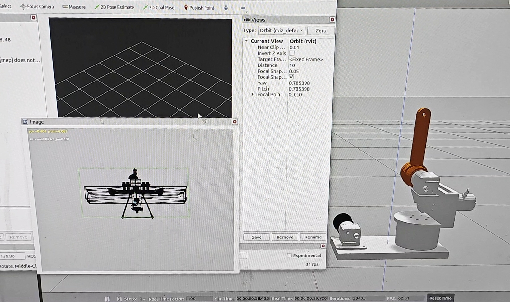
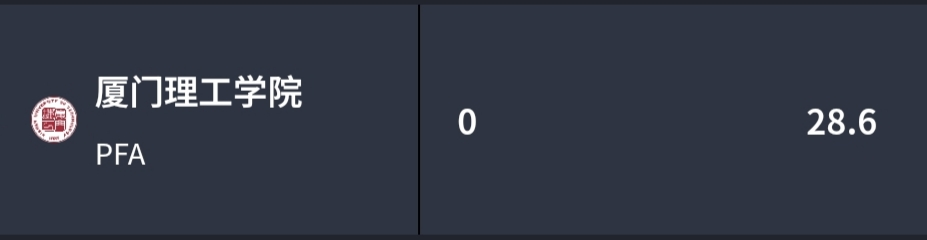
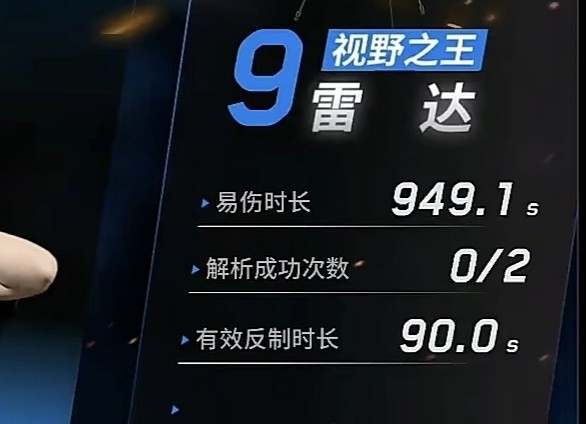

# 厦门理工学院PFA战队2026赛季雷达反制无人机算法开源（双相机云台激光跟踪系统）

#### 功能介绍

基于此算法，可以实现雷达站所有反制功能，主要功能如下：
1. 仿真与实机联通：可在仿真中可完整验证实机通信链路与功能测试。
2. 短焦辅助重获：短焦广角检测无人机，长焦小视场跟踪激光检测模块；长焦丢目标时通过双目外参映射引导重获无人机目标。
3. 螺旋扫描重获：长焦连续丢帧后启动阿基米德螺旋扫描（内密外疏），圆心先取最后已知目标位置，超时后回卷至预设原点，直至重获。
4.激光同轴校准：激光与相机光轴存在偏差，校准时将十字准星对准激光实际落点，记录像素偏差用于跟踪修正；支持 YOLO 自动检测或手动对齐，结果自动回写配置。
（瞄准点计算链路为：boresight 固定偏移 + parallax 距离残差 → 最终瞄准点）

### 效果展示吧

1.仿真环境效果



 
 (仿真无人机在18m~22m远处、0.5m~1.5m高度中随机来回运动)


2.真实赛场效果

 

 因为前几场的扫描范围没调好，没能正常捕获无人机和检测模块 TT… ，后面调好了就可以正常反制啦。



 可以实现每局至少反制一次，至多反制两次。

#### 软件依赖

1. Python >= 3.8（系统 Python3）
2. ROS2 Humble + Gazebo Classic 11
3. 海康 SDK（MvImport，Linux x86_64，仅实机）
4. 海康 ROS2 驱动 

```bash
/usr/bin/python3 -m pip install ultralytics pyserial numpy opencv-python pyyaml
```

#### 硬件要求

1. 海康工业相机（短焦：MV-CS060-10UC-PRO，镜头5-12mm；
   长焦：MV-CS016-10UC，镜头50mm）
2. USB串口
3. NVIDIA GPU（推荐 RTX 3060 以上，TensorRT 推理加速用）
4. 双轴云台（roll：DM-6220，pitch：DM-S2325）
5. 激光发射器

#### 配置环境

```bash
# 1) 安装 ROS2 Humble
#    参考：https://docs.ros.org/en/humble/Installation.html
sudo apt install ros-humble-gazebo-ros-pkgs ros-humble-gazebo-ros2-control

# 2) 安装海康 ROS2 驱动（实机，单独工作区）
cd ~ && mkdir -p hik_ros2_ws/src && cd hik_ros2_ws/src
git clone <hik_camera_ros2_driver 仓库地址>
cd ~/hik_ros2_ws && colcon build --symlink-install

# 3) 构建 radar-sim
cd /home/yy/radar/radar-sim
source /opt/ros/humble/setup.bash
colcon build --symlink-install
source install/setup.bash

# 4) 安装 CH341 串口 udev 规则（实机，避免 /dev/ttyUSB* 漂移）
sudo cp radar_gimbal_gazebo/udev/99-radar-ch341-serial.rules /etc/udev/rules.d/
sudo udevadm control --reload-rules && sudo udevadm trigger
ls -la /dev/radar_USB*   # 验证 → /dev/radar_USB0、/dev/radar_USB1
```

#### 文件目录结构

```
radar-sim/
├── radar_gimbal_gazebo/        # ROS2 功能包
│   ├── launch/                 # sim.launch.py / hw.launch.py / hw_sdk.launch.py
│   ├── scripts/                # lasertracking_tracker.py / gimbal_terminal_control.py 等
│   ├── config/                 # YAML 配置文件
│   ├── urdf/                   # 云台 URDF 模型
│   ├── meshes/                 # 3D 网格
│   ├── worlds/                 # Gazebo 世界
│   └── udev/                   # 串口 udev 规则
├── lasertracking/
│   ├── calibration/            # boresight_calibrator.py / parallax_estimator.py
│   ├── model/                  # YOLO 模型 (.pt/.onnx/.engine)
(：best_new 为仿真无人机模型，laser_new 为实际检测模块模型)
│   └── tracking_system_old/    # 旧版独立跟踪系统
├── MvImport_Linux/             # 海康 SDK Python 封装
└── README.md
```

#### 模型转换（.pt → .engine）

```bash
# 单模型转换
/usr/bin/python3 -c "
from ultralytics import YOLO
YOLO('best_new.pt', task='detect').export(format='engine', imgsz=640, half=True, device=0)
"

# 批量转换
cd lasertracking/model/
for pt in *.pt; do
  /usr/bin/python3 -c "
from ultralytics import YOLO
YOLO('${pt}', task='detect').export(format='engine', imgsz=640, half=True, device=0)
"
done
```

#### 配置文件概览

`config/` 下 YAML 参数体系：

| 文件 | 用途 |
|---|---|
| `sim_launch_params.yaml` | 仿真总控（运动参数、lasertracking 开关） |
| `lasertracking_sim_params.yaml` | 仿真话题名、FOV、循环频率 |
| `lasertracking_hw_params.yaml` | 实机串口、曝光、外参、重获扫描参数 |
| `lasertracking_gimbal_detect_params_common.yaml` | 检测/控制公共参数（模型路径、kp、死区） |
| `lasertracking_gimbal_detect_params_sim.yaml` | 仿真专属覆盖 |
| `lasertracking_gimbal_detect_params_hw.yaml` | 实机专属覆盖 |
| `ros2_controllers.yaml` | ros2_control 控制器 |
| `hik_tele.yaml` / `hik_wide.yaml` | 海康相机曝光/增益/序列号 |

#### 激光校准（boresight）

校准激光光斑与长焦相机光轴偏差，输出 `boresight.yaml`。
详见 `lasertracking/calibration/README.md`。

```bash
# 0) 进入工作区并加载环境
cd /home/yy/radar/radar-sim
source /opt/ros/humble/setup.bash
source install/setup.bash
# 海康 ROS2 驱动
source ~/hik_ros2_ws/install/setup.bash

# 1) 检查配置（不打开相机）
python3 lasertracking/calibration/boresight_calibrator.py   --config lasertracking/tracking_system_old/config_tracking.yaml --check-config

# 2) 标准校准（带 YOLO 检测器）
python3 lasertracking/calibration/boresight_calibrator.py   --config lasertracking/tracking_system_old/config_tracking.yaml

# 3a) 手动校准（不加载检测器）
python3 lasertracking/calibration/boresight_calibrator.py   --config lasertracking/tracking_system_old/config_tracking.yaml --no-detector

# 3b) 用 ROS 长焦图像话题校准（终端 A 先起「仅长焦海康」）
python3 lasertracking/calibration/boresight_calibrator.py   --config lasertracking/tracking_system_old/config_tracking.yaml --no-detector   --ros-image-topic /gimbal_camera/image_raw

# 4) 关闭退出自动保存
python3 lasertracking/calibration/boresight_calibrator.py   --config lasertracking/tracking_system_old/config_tracking.yaml --no-auto-save-on-exit
```

交互操作：鼠标/方向键移动十字准星对准激光落点，`W`/`S` 缩放，`R` 重置，`Space` 确认，`Q`/`Esc` 退出（默认自动保存）。

#### 视差评估

```bash
python3 lasertracking/calibration/parallax_estimator.py --config lasertracking/tracking_system_old/config_tracking.yaml
python3 lasertracking/calibration/parallax_estimator.py --config lasertracking/tracking_system_old/config_tracking.yaml --relative
python3 lasertracking/calibration/parallax_estimator.py --config lasertracking/tracking_system_old/config_tracking.yaml --csv
```

#### 启动仿真

```bash
cd /home/yy/radar/radar-sim
source /opt/ros/humble/setup.bash
source install/setup.bash

# 完整仿真（无人机随机运动 + 激光跟踪）
ros2 launch radar_gimbal_gazebo sim.launch.py

# 不带无人机（命令行覆盖 YAML）
ros2 launch radar_gimbal_gazebo sim.launch.py drone_random_motion:=false

# 不开激光跟踪
ros2 launch radar_gimbal_gazebo sim.launch.py enable_lasertracking:=false
```

> 不带参数默认开启无人机运动与激光跟踪，无需额外配置。
（仿真运动参数在 `config/sim_launch_params.yaml` 中调整，也可命令行覆盖。）

```bash
# rviz2 查看相机话题
rviz2
# 手动添加：/fixed_camera/image_raw（短焦）、/gimbal_camera/image_raw（长焦）、/lasertracking/debug_image（调试图）
```

#### 实机运行

```bash
# 每次新终端必须加载环境
cd /home/yy/radar/radar-sim
source /opt/ros/humble/setup.bash
source install/setup.bash
source ~/hik_ros2_ws/install/setup.bash

# 1) 仅跟踪节点（相机已单独启动时）
ros2 launch radar_gimbal_gazebo hw.launch.py

# 2) 相机 + 跟踪一体启动（推荐）
ros2 launch radar_gimbal_gazebo hw_sdk.launch.py

# 3) 一体启动但不跟踪（调试相机）
ros2 launch radar_gimbal_gazebo hw_sdk.launch.py start_tracker:=false

# 4) 仅长焦海康、不跟踪（boresight 用）
ros2 launch radar_gimbal_gazebo hw_sdk.launch.py start_tracker:=false start_wide_camera:=false

# 5) 双相机全开（默认只开长焦）
ros2 launch radar_gimbal_gazebo hw_sdk.launch.py start_wide_camera:=true
```

#### 通信协议

上位机 → 下位机串口发送（单位：度、度/秒）：

- **Raw（16B）**：`pitch(f32) roll(f32) v_pitch(f32) v_roll(f32)`
- **Framed（23B）**：`0xCD pitch(f32) roll(f32) v_pitch(f32) v_roll(f32) ts(u32) CRC8 0xDC`（CRC8-ATM, poly=0x07）

下位机反馈同 Framed 格式，经 `gimbal_comm_bridge` 解析发布。

#### 云台终端控制

用于手动测试云台运动，不依赖跟踪节点：

```bash
# 新协议：pitch roll v_pitch v_roll（度，度/秒）
ros2 run radar_gimbal_gazebo gimbal_terminal_control

# 单位改为弧度
ros2 run radar_gimbal_gazebo gimbal_terminal_control -- --rad

# 兼容旧协议：yaw pitch
ros2 run radar_gimbal_gazebo gimbal_terminal_control -- --legacy
```

> pitch>0 上仰，roll>0 左转，均为相对上电初始姿态的绝对角。


#### 话题速查

| 话题 | 方向 | 说明 |
|---|---|---|
| `/gimbal_camera/image_raw` | 订阅 | 长焦图像 |
| `/fixed_camera/image_raw` | 订阅 | 短焦图像 |
| `/joint_states` | 订阅 | 云台角度（yaw_joint, pitch_joint） |
| `/lasertracking/upper_cmd` | 发布 | 控制命令 [pitch,roll,v_pitch,v_roll] |
| `/lasertracking/lower_feedback` | 发布 | 下位机反馈 |
| `/lasertracking/debug_image` | 发布 | 长焦调试图 |
| `/lasertracking/wide_debug_image` | 发布 | 短焦调试图 |

```bash
ros2 topic echo /lasertracking/upper_cmd     # 监听控制命令
ros2 topic hz /gimbal_camera/image_raw       # 查看帧率
ros2 run rqt_image_view rqt_image_view /lasertracking/debug_image
```

#### 
有问题或者想要一起交流可以联系我呀，qq：2538461760
